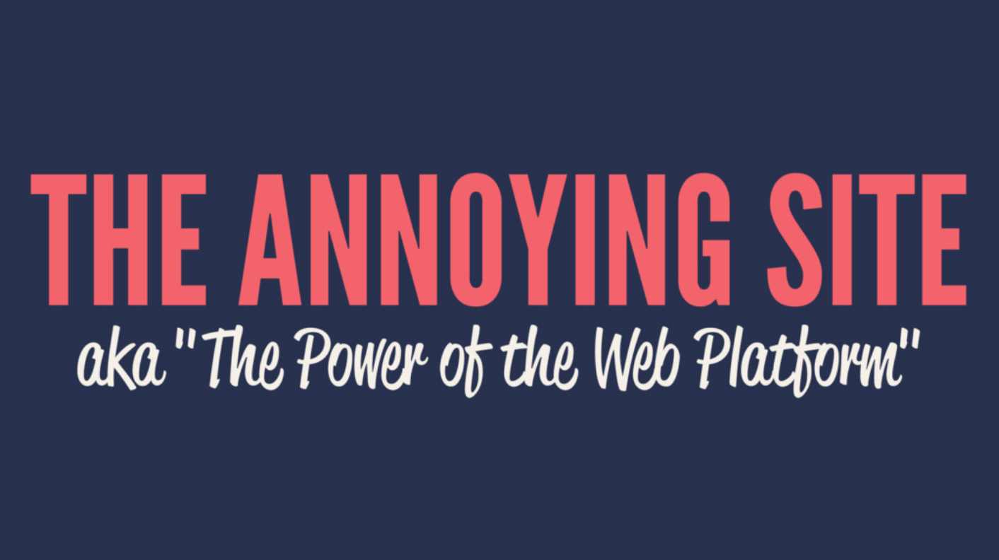
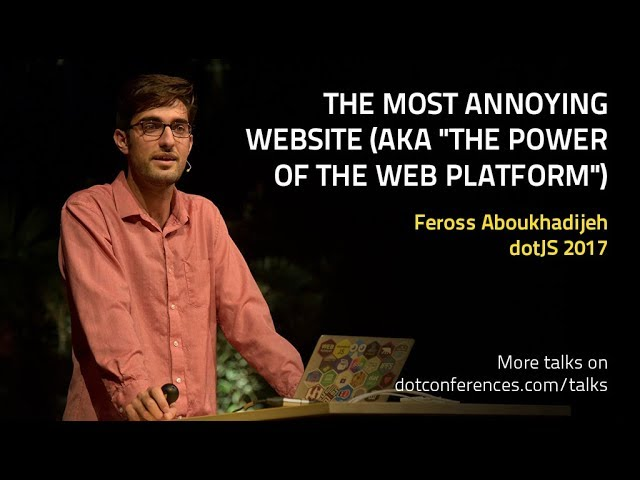

### DEMO: [theannoyingsite.com](https://theannoyingsite.com)

**Warning:** Site is annoying. Consider opening in an alternate browser so you can force quit it easily.

### GET CODE: All the code is in [`static/index.js`](https://github.com/feross/TheAnnoyingSite.com/blob/master/static/index.js).

## Where is the talk video?

The talk video is available on [YouTube][1].

[][1]

[1]: https://www.youtube.com/watch?v=QFZ-pwErSl4

## What is this?

This is the GitHub repo that goes along with the talk I gave at [JSConf US 2018](https://2018.jsconf.us/) in Carlsbad, CA and earlier at [dotJS 2017](https://www.dotjs.io/) in Paris, France.

**Talk Title:**

The Annoying Site – "The Power of the Web Platform"

**Alternative Title:**

The Worst Webpage in the World

**Talk description:**

It's 2018. The web platform offers dozens of powerful, native-like APIs. What if we used this newfound power for evil? What kind of terrible UX could we create if our goal was to build the worst web page in the world?

This talk will be an adventure deep into little-known parts of the web platform. We'll explore archaic Netscape Navigator APIs and powerful standards-based APIs and use them to build a website with powers you'd never believe possible on the Web today.

**My bio:**

I'm Feross. I'm a mad scientist; I like to build software that makes people say "Wow, I didn't know that was possible!" I'm the author of [WebTorrent](https://webtorrent.io), [Standard](https://standardjs.com), and some other JavaScript open source projects. Also, recently, see [BitMidi](https://bitmidi.com).

## Where are the slides?

Slides are available on [SpeakerDeck][2].

[2]: https://speakerdeck.com/feross/the-annoying-site-aka-power-of-the-web-platform-v2

## License

Copyright (c) [Feross Aboukhadijeh](https://feross.org)
